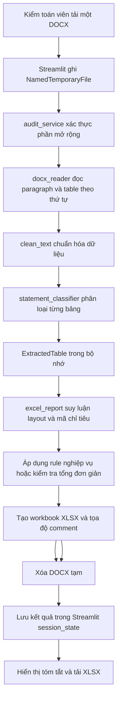

# Project Structure and Architecture Guide

> Tài liệu này là bản đồ kiến trúc của dự án. Người dùng và AI coding agent nên đọc tài liệu trước khi chỉnh sửa source code.

- Ngày cập nhật gần nhất: 2026-09-28
- Repository root: `CHECK_FS`
- Python version: Chưa xác định được từ repository (runtime dùng để rà soát: Python 3.13.13)
- Entry point chính: `app.py`
- Trạng thái tài liệu: Tự động tổng hợp từ source code

## 1. Tổng quan dự án

CHECK_FS là ứng dụng web Streamlit hỗ trợ kiểm toán viên tải báo cáo tài chính dạng DOCX, trích xuất các bảng, phân loại bảng theo loại báo cáo, chuẩn hóa dữ liệu số và tạo báo cáo kiểm tra dạng XLSX.

| Nội dung | Hiện trạng được xác nhận |
| --- | --- |
| Đối tượng chính | Kiểm toán viên, theo `AGENTS.md` |
| Loại ứng dụng | Web app xử lý dữ liệu/tự động hóa báo cáo |
| Framework UI | Streamlit |
| Đọc đầu vào | `python-docx` |
| Tạo đầu ra | `openpyxl` |
| Entry point | `app.py` gọi `src.ui.streamlit_app.main()` |
| Đầu vào thực tế của MVP | Một tệp `.docx` |
| Đầu ra thực tế | Dữ liệu XLSX và, theo lựa chọn mặc định bật, bản DOCX có comment trong bộ nhớ để tải xuống |

Các chức năng cốt lõi hiện có:

- Nhận diện chế độ kế toán ở cấp tài liệu theo viện dẫn Thông tư trong toàn bộ đoạn văn, sau đó mới dùng ký hiệu biểu mẫu làm bằng chứng cấu trúc dự phòng. Hiện registry có bộ rule đã xác nhận cho Thông tư 200/2014/TT-BTC; Thông tư 133/2016/TT-BTC và Thông tư 99/2025/TT-BTC được nhận diện để cảnh báo nhưng chưa áp rule nghiệp vụ khi chưa có `RulePack` tương ứng.
- Service chọn `RulePack` trước khi tạo báo cáo. Nếu không xác định được, phát hiện nhiều Thông tư hoặc chưa có bộ rule đã đăng ký, hệ thống không mặc định dùng rule TT200 và không chạy đối chiếu Thuyết minh–BCTC phụ thuộc bộ rule.

- Đọc bảng trong DOCX theo đúng thứ tự xen kẽ giữa đoạn văn và bảng.
- Phân loại bảng thành BS tài sản, BS nguồn vốn, PL, CF, thuyết minh, thông tin chung, chữ ký hoặc chưa phân loại; các bảng mục lục, danh sách Ban Giám đốc, địa điểm kinh doanh và khối ký/đại diện được nhận diện là thông tin chung hoặc chữ ký thay vì rơi vào `Chưa phân loại`. Các bảng thông tin về thời gian khấu hao, kể cả mẫu chỉ có header `Năm`, nhiều nhóm tài sản và các khoảng như `5 - 7`; bảng một dòng so sánh đầu/cuối kỳ; bảng phân tách `Ngắn hạn`/`Dài hạn`; khối tiếp nối `Dự phòng phải thu`/`Giá trị thuần`; và bảng `Giao dịch với các bên liên quan` có cột `Bên liên quan`/`Mối quan hệ` được nhận diện là Thuyết minh ngay cả khi không có từ khóa tiền tệ. Rule bảng bên liên quan chạy trước nhận diện chữ ký để chức danh trong dữ liệu không làm sai phân loại.
- Chuẩn hóa Unicode và nhận diện chuỗi số/ký hiệu số kế toán.
- Kiểm tra công thức theo mã chỉ tiêu, dấu của một số chỉ tiêu CF và quan hệ giữa kỳ/báo cáo.
- Mọi công thức kiểm tra chênh lệch được chuẩn hóa bằng `ROUND(...,2)` để hỗ trợ cả VND và ngoại tệ có hai chữ số thập phân. Logic Python dùng `Decimal` với `ROUND_HALF_UP` đến `0.01`; chỉ kết luận/comment khi chênh lệch sau làm tròn khác 0. Ô chênh lệch dùng định dạng hiển thị tối đa hai chữ số thập phân.
- Kiểm tra cộng dọc/cộng ngang đơn giản cho các bảng không áp dụng được rule nghiệp vụ; dòng tổng hỗ trợ các nhãn cụ thể như `Tổng cộng`, `Giá trị thuần`, `Doanh thu thuần`, `Số dư cuối năm/kỳ` và `Số cuối năm/kỳ`. Dòng có nhãn tổng rõ ràng vẫn được kiểm tra khi chỉ có một dòng thành phần. Subtotal không nhãn được nhận diện khi ô số in đậm có border hoặc có đường tổng mạnh `double/thick`; subtotal một dòng được hỗ trợ. Với nhóm `Trừ:`, cả hai subtotal được kiểm tra theo thành phần riêng và dòng `Doanh thu thuần` hoặc `Tổng cộng` được kiểm tra theo quan hệ subtotal trước trừ subtotal khoản giảm trừ. Với bảng biến động, phép kiểm tra cuối kỳ bao gồm dòng `Số đầu...`/`Số dư đầu...` gần nhất hoặc dòng chuyển tiếp như `Số cuối năm trước, đầu năm nay` trong vùng cộng. Bảng thuế có các cột `Số đầu năm`, `Số phải nộp`, `Số đã nộp, khấu trừ`, `Số cuối năm` được kiểm tra từng dòng theo `Cuối = Đầu + Phải nộp - ABS(Đã nộp, khấu trừ)`, chấp nhận cả style trình bày dấu dương, dấu âm và dấu gạch ngang. Bảng tính thuế TNDN được kiểm tra theo chuỗi `Lợi nhuận trước thuế → Thu nhập chịu thuế → Thu nhập tính thuế → Chi phí thuế hiện hành`; các khoản điều chỉnh giảm/chuyển lỗ dùng `ABS()`, hai khối `Trong đó` được cộng theo chi tiết và chi phí thuế hiện hành được cộng từ các dòng thuế thành phần khi có đủ dữ liệu. Khối tiếp nối phải thu kiểm tra liên bảng theo `Giá trị thuần = Tổng cộng ở bảng trước + Dự phòng`, kế thừa hai kỳ và loại bản sao giá trị do merge trước khi lập công thức. Với bảng tài sản cố định có đủ ba khối `Nguyên giá`, `Giá trị hao mòn` hoặc `Giá trị khấu hao`, `Giá trị còn lại`, số đầu/cuối năm của giá trị còn lại được đối chiếu với hai dòng cùng kỳ ở hai khối nguồn.
- Bảng TM mô tả hợp đồng/khoản vay có nhiều trường như số/ngày hợp đồng, ngày đáo hạn, hạn mức cho vay, thời hạn, mục đích, lãi suất, tài sản thế chấp/đảm bảo nhưng không có dòng `Tổng cộng` được nhận diện là bảng thông tin trước bước sinh công thức, ghi trạng thái `Không kiểm tra`; `Số dư cuối kỳ` không bị hiểu sai là tổng của hạn mức hoặc metadata hợp đồng. Các bảng này cũng được loại khỏi đối chiếu TM–BCTC để không tạo cảnh báo thiếu số liệu khi không có tổng số dư theo chỉ tiêu.
- Các bảng TM thông tin khác gồm bảng thời gian/số năm khấu hao, kể cả mẫu chỉ có cột `Năm` và nhiều khoảng thời gian theo nhóm tài sản; disclosure nguyên giá TSCĐ đã khấu hao hết nhưng vẫn còn sử dụng; thuyết minh một giá trị tài sản thế chấp/cầm cố; và bảng hai kỳ chỉ có một dòng dữ liệu đều được ghi `Không kiểm tra`, không tạo comment số học hoặc đối chiếu thủ công. Bảng nhiều dòng chưa rõ nhưng không khớp các mẫu này vẫn là `Cần xem xét`.
- Bảng giao dịch hoặc số dư bên liên quan có cột hai kỳ, có số tiền nhưng không có dòng tổng được đặt Nội dung bảng `Bên liên quan`, trạng thái `Không kiểm tra` và không tạo comment Word. Nếu xuất hiện dòng tổng, bảng vẫn đi qua luồng kiểm tra số học thông thường.
- Bảng danh sách/giao dịch bên liên quan không cần đối chiếu và bảng nghĩa vụ tiền thuê tương lai được loại khỏi matcher BCTC. Sheet chi tiết hiển thị `Không áp dụng đối chiếu BCTC cho bảng này`, cột trạng thái đối chiếu tại `00_Tong_hop` ghi `Không áp dụng` và không tạo comment Word; kiểm tra cộng dọc độc lập của bảng tiền thuê vẫn được giữ nguyên.
- Riêng bảng danh sách có cột `Bên liên quan`/`Mối quan hệ` hiển thị cả Nội dung bảng và Loại bảng là `Giao dịch với các bên liên quan`; kiểu xử lý nội bộ vẫn là Thuyết minh để giữ tương thích với sheet và pipeline hiện hữu.
- Bảng `Chưa phân loại` nhưng không có giá trị số kế toán ở các cột dữ liệu được ghi `Không kiểm tra` và không tạo comment Word; nếu có giá trị số kế toán thì vẫn giữ `Cần xem xét` để tránh che mất dữ liệu tài chính chưa có rule.
- Tra cứu và đối chiếu bảng Thuyết minh với chỉ tiêu BS/PL/CF theo tham chiếu, tên và giá trị; giữ danh sách ứng viên khi chưa đủ cơ sở chọn duy nhất. Với mẫu Thông tư 200, bảng biến động `Vốn chủ sở hữu` đối chiếu riêng `Vốn góp của chủ sở hữu` với BS mã 411, `Lợi nhuận sau thuế chưa phân phối` với BS mã 421 và các dòng lợi nhuận trong năm với PL mã 60; kỳ trước lấy dòng chuyển tiếp `Số cuối năm trước, đầu năm nay`, không lấy `Số đầu năm trước`. Bảng thông tin thuần túy và bảng biến động thuế (`Số đầu năm`, `Số phải nộp`, `Số đã nộp, khấu trừ`, `Số cuối năm`) được ghi `Không áp dụng` và không tạo comment đối chiếu. Bảng có tiêu đề rõ ràng cùng dòng `Tổng cộng` nhưng không tìm được chỉ tiêu BCTC vẫn ghi `Không tìm thấy chỉ tiêu BCTC` trong Excel và tạo comment Word tại ô tổng hai kỳ để kiểm toán viên xác minh; bảng không có căn cứ tổng/đích rõ ràng không tạo comment chung chung.
- Nhận diện định dạng dấu phân cách số bất thường so với đa số trong bảng.
- Tạo workbook gồm sheet `00_Tong_hop` và một sheet chi tiết cho mỗi bảng. Cột C/D lần lượt là `Nội dung bảng` và `Loại bảng`; giao diện Streamlit dùng chung helper nhãn với hai cột này. `00_Tong_hop` có cột `Trạng thái đối chiếu BCTC`; từng sheet Thuyết minh đặt khối đối chiếu dọc ngay dưới dữ liệu/kiểm tra và căn giá trị BCTC, chênh lệch theo đúng cột kỳ của TM.

Giới hạn quan trọng: `src/io/file_detector.py` liệt kê nhiều phần mở rộng được hỗ trợ, nhưng `src/services/audit_service.py` hiện chỉ chấp nhận DOCX và giao diện cũng chỉ cho tải DOCX. Không có chức năng đọc XLSX/XLSB/CSV/TXT/DOC/DOCM trong luồng chạy hiện tại.

## 2. Cấu trúc thư mục

```text
CHECK_FS/
├── app.py
├── requirements.txt
├── AGENTS.md
├── PROJECT_STRUCTURE.md
├── src/
│   ├── __init__.py
│   ├── domain/
│   │   ├── accounting_regime_detector.py
│   │   ├── __init__.py
│   │   ├── arithmetic_checker.py
│   │   ├── models.py
│   │   └── audit_rules.py
│   ├── extraction/
│   │   ├── __init__.py
│   │   ├── statement_classifier.py
│   │   ├── table_layout.py
│   │   └── table_values.py
│   ├── io/
│   │   ├── __init__.py
│   │   ├── file_detector.py
│   │   └── docx_reader.py
│   ├── normalization/
│   │   ├── __init__.py
│   │   ├── text_cleaner.py
│   │   └── number_parser.py
│   ├── reporting/
│   │   ├── __init__.py
│   │   ├── excel_report.py
│   │   ├── excel_styles.py
│   │   ├── word_comment_report.py
│   │   └── excel/
│   │       ├── __init__.py
│   │       ├── builder.py
│   │       ├── formatter.py
│   │       ├── formulas.py
│   │       └── reconciler.py
│   ├── reconciliation/
│   │   ├── __init__.py
│   │   └── note_matcher.py
│   ├── services/
│   │   ├── __init__.py
│   │   └── audit_service.py
│   └── ui/
│       ├── __init__.py
│       └── streamlit_app.py
├── tests/
│   ├── test_audit_rules.py
│   ├── test_arithmetic_checker.py
│   ├── test_number_parser.py
│   ├── test_table_layout.py
│   ├── test_table_values.py
│   └── ...
├── *.docx                 # Báo cáo tài chính mẫu/đầu vào thử nghiệm
├── *.xlsx                 # Workbook mẫu/kết quả thử nghiệm
└── *.xlsm                 # Workbook kết quả có VBA
```

Các thành phần chính:

- `app.py`: bootstrap tối giản cho Streamlit.
- `src/domain/`: mô hình dữ liệu, nhận diện chế độ kế toán, registry `RulePack` và các rule kiểm toán khai báo tĩnh.
- `src/io/`: nhận diện phần mở rộng và đọc DOCX.
- `src/extraction/`: phân loại bảng và suy luận layout cột từ nội dung đã trích xuất.
- `src/normalization/`: chuẩn hóa văn bản và chuyển chuỗi số kế toán.
- `src/services/`: điều phối use case phân tích tệp và tạo báo cáo.
- `src/reporting/`: tạo báo cáo Excel/Word; palette và style Excel dùng chung nằm tại `excel_styles.py`.
- `src/reconciliation/`: matching và đối chiếu Thuyết minh với chỉ tiêu BS/PL/CF.
- `src/ui/`: giao diện, session state, tệp tạm và tải kết quả.
- `tests/`: unit/regression test cho rule, parser, reader, đối chiếu, reporter, service và UI wiring.
- Các tệp DOCX/XLSX/XLSM ở root: dữ liệu mẫu và sản phẩm đầu ra dùng để kiểm tra thủ công. Tài liệu này không ghi nội dung bên trong để tránh lộ dữ liệu báo cáo.
- `.agents/`: thư mục hiện không có tệp ảnh hưởng đến ứng dụng.

Không tìm thấy migration, template giao diện, static assets, Dockerfile, cấu hình CI/CD, cấu hình deployment, `README.md` hoặc `CONTRIBUTING.md`.

## 3. Điểm khởi chạy chương trình

### Entry point chính

`app.py`:

```text
app.py
→ src.ui.streamlit_app.main()
→ _init_session_state()
→ nhận một UploadedFile DOCX
→ dùng thứ tự STT bảng tăng dần mặc định cho `00_Tong_hop`
→ ghi vào NamedTemporaryFile
→ src.services.audit_service.create_audit_outputs()
→ analyze_file()
→ src.io.docx_reader.read_docx_tables()
→ classify_table() + clean_text()
→ src.reporting.excel_report.build_audit_workbook_with_comment_targets()
→ tạo bytes XLSX và danh sách WordCommentTarget đúng tọa độ nguồn
→ service chuyển WordCommentTarget thành danh sách vấn đề ưu tiên dùng chung cho UI
→ nếu người dùng chọn: word_comment_report neo comment vào DOCX gốc
→ trả list[ExtractedTable], bytes XLSX và bytes DOCX tùy chọn
→ xóa tệp tạm
→ lưu kết quả trong st.session_state
→ hiển thị số sai lệch/cần xem xét/bảng bị ảnh hưởng, danh sách vấn đề ưu tiên và nút tải kết quả
→ danh sách toàn bộ bảng chỉ hiển thị trong vùng mở rộng để phục vụ truy vết
```

Lệnh chạy được xác nhận từ cấu trúc Streamlit:

```powershell
streamlit run app.py
```

Entry point phụ ở cấp hàm:

- `src.services.audit_service.analyze_file(path)`: đọc và phân loại bảng, chỉ nhận DOCX.
- `src.services.audit_service.create_audit_report(path, *, summary_sort=..., note_reconciliation_sort=...)`: tạo kết quả hoàn chỉnh trong bộ nhớ và chuyển lựa chọn sắp xếp tới reporter.
- `src.services.audit_service.create_audit_outputs(...)`: API dùng bởi UI; luôn tạo Excel và cố tạo Word có comment. Lỗi tạo Word không làm mất đầu ra Excel.
- `src.reporting.excel_report.save_audit_workbook(tables, output_path, *, summary_sort=..., note_reconciliation_sort=...)`: ghi workbook ra đường dẫn; không được entry point hiện tại gọi.

Không có CLI command, API server, worker, scheduler hoặc script tác vụ độc lập khác.

## 4. Mô tả từng module

#### `app.py`

**Vai trò:** Bootstrap ứng dụng.

**Thành phần chính:** Khối `if __name__ == "__main__"` gọi `main()`.

**Phụ thuộc:** `src/ui/streamlit_app.py`.

**Được sử dụng bởi:** Lệnh `streamlit run app.py`.

**Lưu ý khi chỉnh sửa:** Giữ file mỏng; logic UI và nghiệp vụ đang được đặt ở module tương ứng.

#### `src/domain/models.py`

**Vai trò:** Định nghĩa kiểu miền dùng xuyên suốt pipeline.

**Thành phần chính:**

- `StatementType`: enum phân loại bảng.
- `TableValueStatus`, `TableValue`: trạng thái và giá trị kế toán typed, giữ `Decimal` và phân biệt số, số 0, dấu gạch, thiếu và không hợp lệ.
- `CellBorder`, `CellPresentation`: metadata trình bày ô DOCX dùng để phục hồi định dạng trong sheet Thuyết minh.
- `ExtractedTable`: bảng đã trích xuất, gồm dữ liệu/loại/ngữ cảnh, metadata trình bày theo ô, vùng gộp, độ rộng cột tương đối và hai property kích thước.
- `TableCheckResult`: trạng thái, số phép kiểm tra/sai sót, ghi chú và tọa độ ô công thức.
- `NoteMatchResult`: kết quả đối chiếu gồm nguồn, mã chỉ tiêu/mã Thuyết minh, giá trị hai kỳ, chênh lệch, trạng thái, kiểu khớp và điểm khớp.

**Input/Output:** Các dataclass nhận dữ liệu Python thuần và truyền giữa reader, classifier, service, reporter và UI.

**Được sử dụng bởi:** `statement_classifier.py`, `docx_reader.py`, `audit_rules.py`, `excel_report.py`, `streamlit_app.py` (gián tiếp qua service).

**Lưu ý khi chỉnh sửa:** Các dataclass là interface chung. Thay đổi field hoặc giá trị enum ảnh hưởng phân loại, rule, tên sheet, sắp xếp và phần hiển thị.

#### `src/domain/audit_rules.py`

**Vai trò:** Khai báo rule nghiệp vụ theo mã số chỉ tiêu.

**Thành phần chính:** `RuleTerm`, `ArithmeticRule`, `SignRule`, `CrossPeriodRule`; các bộ `ASSET_RULES`, `EQUITY_RULES`, `INCOME_RULES`, `CASH_FLOW_RULES`, `CASH_FLOW_SIGN_RULES`, `CROSS_PERIOD_RULES`; registry `ARITHMETIC_RULES_BY_TYPE`.

**Input:** Mã chỉ tiêu, hệ số, nguồn báo cáo, kỳ nguồn/kỳ đích.

**Output:** Cấu hình bất biến để `excel_report.py` sinh công thức và tính sai lệch trực tiếp.

**Phụ thuộc:** `StatementType`.

**Được sử dụng bởi:** `src/reporting/excel_report.py`, `src/domain/arithmetic_checker.py`.

**Lưu ý khi chỉnh sửa:** Đây là logic nghiệp vụ kiểm toán. Không thay đổi công thức, dấu hoặc quan hệ chéo khi chưa được người dùng xác nhận. Registry rule hiện đã có regression test chuyên biệt.

#### `src/domain/arithmetic_checker.py`

**Vai trò:** Tính arithmetic rule nội bảng bằng `Decimal` trên lookup typed và trả rõ danh sách mã cần xác minh khi dữ liệu thiếu hoặc không hợp lệ.

**Public:** `ArithmeticCheckValue`, `calculate_same_table_arithmetic()`.

**Quy tắc hiện tại:** `NUMBER`, `ZERO`, `DASH_ZERO` được phép tính; dòng có `MISSING` hoặc `INVALID` yêu cầu xem xét. Mã thành phần không có dòng được coi là không phát sinh và bị loại khỏi phép cộng. Nếu không có mã thành phần nào thì rule không áp dụng. Nếu có thành phần cần kiểm tra nhưng thiếu mã đích, reporter cảnh báo tại thành phần; ô bằng 0 hoặc dấu gạch không tạo comment. Rule có nguồn từ báo cáo khác bị từ chối tại ranh giới này.

**Được sử dụng bởi:** `src/reporting/excel_report.py`; được test trong `tests/test_arithmetic_checker.py` và integration test workbook.

#### `src/io/file_detector.py`

**Vai trò:** Lấy phần mở rộng và kiểm tra với `SUPPORTED_EXTENSIONS`.

**Thành phần chính:** `detect_extension()`, `is_supported()`.

**Input/Output:** Tên tệp → phần mở rộng chữ thường hoặc `bool`.

**Được sử dụng bởi:** `audit_service.py` chỉ dùng `detect_extension()`; `is_supported()` chưa được gọi trong source hiện tại.

**Lưu ý khi chỉnh sửa:** Danh sách extension rộng hơn khả năng reader thực tế; không được coi danh sách này là bằng chứng rằng mọi định dạng đã xử lý được.

#### `src/io/docx_reader.py`

**Vai trò:** Mở DOCX, duyệt paragraph/table theo thứ tự tài liệu, trích xuất dữ liệu cùng metadata trình bày và tạo `ExtractedTable`.

**Thành phần chính:** `read_docx_tables()`, `_iter_document_blocks()`.

**Input:** Đường dẫn DOCX.

**Output:** `list[ExtractedTable]`.

**Phụ thuộc:** `python-docx`, `models.py`, `statement_classifier.py`, `text_cleaner.py`.

**Được sử dụng bởi:** `audit_service.analyze_file()`.

**Lưu ý khi chỉnh sửa:** Có sử dụng XML nội bộ của `python-docx` để giữ thứ tự block và đọc màu nền/đường viền. Reader giữ ô gộp, độ rộng cột, bold/italic/underline và căn lề khi có đủ metadata; định dạng run hỗn hợp trong cùng ô không được suy diễn thành định dạng toàn ô. `title_hint` của bảng Thuyết minh ưu tiên paragraph có numbering gần nhất; các loại bảng khác lấy paragraph không rỗng gần nhất và fallback sang nội dung bảng.

#### `src/extraction/statement_classifier.py`

**Vai trò:** Phân loại bảng bằng heuristic từ tối đa 8 dòng đầu đã bỏ dấu/chuẩn hóa; riêng bảng phân tách `Ngắn hạn`/`Dài hạn` có thể dùng tiêu đề và ngữ cảnh gần nhất do reader cung cấp.

**Thành phần chính:** `classify_table()`, `get_title_hint()`, `_joined()`.

**Input:** `list[list[str]]`.

**Output:** `StatementType` và chuỗi gợi ý tiêu đề.

**Phụ thuộc:** `models.py`, `text_cleaner.normalized_key()`.

**Được sử dụng bởi:** `docx_reader.py`.

**Lưu ý khi chỉnh sửa:** Thứ tự các điều kiện có ý nghĩa; heuristic phụ thuộc cụm từ tiếng Việt và chỉ đọc 8 dòng đầu. Chưa có test phân loại.

#### `src/normalization/text_cleaner.py`

**Vai trò:** Chuẩn hóa khoảng trắng và Unicode.

**Thành phần chính:** `clean_text()` chuẩn hóa NFC; `normalized_key()` chuyển chữ thường, bỏ dấu bằng NFD và gộp khoảng trắng.

**Input/Output:** Giá trị bất kỳ → chuỗi sạch/khóa so sánh.

**Được sử dụng bởi:** reader, classifier, parser số và reporter.

**Lưu ý khi chỉnh sửa:** Đây là dependency nền dùng rộng; thay đổi cách bỏ dấu có thể làm sai classifier và nhận diện nhãn tổng.

#### `src/normalization/number_parser.py`

**Vai trò:** Chuyển chuỗi số phổ biến và định dạng kế toán thành `Decimal`.

**Thành phần chính:** `parse_accounting_number()`, `looks_like_number()`, `_normalize_separators()`.

**Input:** Chuỗi/số; hỗ trợ dấu chấm/phẩy, khoảng trắng, `VND`/`VNĐ`, dấu âm và ngoặc kế toán.

**Output:** `Decimal` hoặc `None`.

**Được sử dụng bởi:** `excel_report.py`; test trực tiếp trong `tests/test_number_parser.py`.

**Lưu ý khi chỉnh sửa:** Heuristic xem một nhóm ba chữ số sau dấu chấm/phẩy là hàng nghìn. Tránh đổi quy tắc khi chưa đánh giá dữ liệu thực và test hồi quy.

#### `src/services/audit_service.py`

**Vai trò:** Service điều phối use case.

**Thành phần chính:** `UnsupportedFileError`, `analyze_file()`, `create_audit_report()`.

**Input:** Đường dẫn tệp và hai khóa sắp xếp tùy chọn; mặc định đều theo STT bảng tăng dần.

**Output:** Danh sách bảng hoặc tuple `(tables, workbook_bytes)`.

**Phụ thuộc:** `file_detector.py`, `docx_reader.py`, `excel_report.py`.

**Được sử dụng bởi:** `streamlit_app.py`.

**Lưu ý khi chỉnh sửa:** Đây là ranh giới giữa UI và pipeline. Việc hỗ trợ định dạng mới cần reader thật tương ứng, không chỉ mở rộng extension.

#### `src/reconciliation/note_matcher.py`

**Vai trò:** Trích xuất chỉ tiêu BS/PL/CF, tìm ứng viên cho riêng bảng `StatementType.NOTE`, lấy giá trị hai kỳ và đối chiếu với dung sai làm tròn mặc định 1 đơn vị trình bày.

**Thành phần chính:** `reconcile_note_tables()`, `StatementItem`, registry mã cho TSCĐ hữu hình `221/222/223`, thuê tài chính `224/225/226`, vô hình `227/228/229`, BĐS đầu tư `230/231/232`; các helper xác định ba khối/kỳ/cột tổng và matcher tham chiếu Thuyết minh cho các bảng còn lại.

**Input:** `list[ExtractedTable]`.

**Output:** `list[NoteMatchResult]`; trạng thái nội bộ giữ khóa tiếng Anh để ổn định logic, còn reporter chuyển sang nhãn tiếng Việt khi ghi Excel.

**Phụ thuộc:** Domain models, `number_parser.py` và `text_cleaner.py`.

**Được sử dụng bởi:** `src/reporting/excel_report.py`; được test trong `tests/test_note_matcher.py`.

**Lưu ý khi chỉnh sửa:** Với bốn nhóm tài sản trong registry, nguyên giá, hao mòn và giá trị còn lại được đối chiếu trực tiếp theo mã BS và kỳ, không phụ thuộc tham chiếu TM hoặc giá trị gần nhất. Tài sản sinh học/nhóm khác chưa có registry do source chưa xác nhận hệ mã. Với bảng còn lại, chỉ dùng tên/ngữ cảnh đủ rõ để xác định mã tham chiếu Thuyết minh; không có fallback fuzzy và không dùng giá trị để suy diễn quan hệ. Không tăng dung sai làm tròn nếu chưa có xác nhận nghiệp vụ/đơn vị trình bày.

#### `src/reporting/excel_report.py`

**Vai trò:** Tạo toàn bộ workbook kết quả và thực thi logic kiểm tra. Đây là module lớn nhất của dự án.

**Thành phần chính:**

- Public: `build_audit_workbook()`, `save_audit_workbook()`.
- Layout/lookup: sử dụng `extraction/table_layout.py` và `extraction/table_values.py`; reporter vẫn giữ alias nội bộ tương thích cho các helper cũ. Việc chọn bảng gần nhất vẫn nằm tại `_nearest_statement_tables()`.
- Rule nghiệp vụ: arithmetic nội bảng dùng `domain/arithmetic_checker.py`; reporter còn điều phối `_write_business_checks()`, `_write_inline_arithmetic_check()`, `_write_inline_sign_check()`, `_write_inline_cross_period_check()`.
- Kiểm tra bảng thuyết minh: `_write_vertical_note_checks()`, `_write_horizontal_note_checks()`.
- Định dạng/sai lệch: `_expected_number_style()`, `_has_number_format_issue()`, `_write_sheet_totals()`, `_write_summary()`, phục hồi trình bày nguồn cho sheet TM và làm nổi bật dòng tổng.
- Đối chiếu Thuyết minh: gọi `reconcile_note_tables()`, tổng hợp kết luận theo từng bảng vào `00_Tong_hop` và ghi các khối đối chiếu dọc tại từng sheet TM; mỗi ứng viên có khối riêng, công thức BCTC/chênh lệch đặt cùng cột kỳ với TM nguồn.
- Sắp xếp đầu ra: `_sort_summary_tables()` và validation khóa sắp xếp; thứ tự vật lý của sheet chi tiết luôn theo `ExtractedTable.index` tăng dần.
- Điều hướng: sau khi sắp xếp `00_Tong_hop`, reporter cập nhật liên kết `← Quay lại 00_Tong_hop` của từng sheet chi tiết tới đúng ô tên sheet tại cột B của dòng tương ứng; không hard-code `A1`.

**Input:** `list[ExtractedTable]` và hai khóa sắp xếp keyword-only có giá trị mặc định tương thích ngược.

**Output:** `bytes` XLSX hoặc ghi ra file qua `save_audit_workbook()`.

**Phụ thuộc:** `openpyxl`, domain models/rules, `extraction/table_layout.py`, `extraction/table_values.py`, parser số và text cleaner.

**Được sử dụng bởi:** `audit_service.py`.

**Lưu ý khi chỉnh sửa:** Module nhận layout đã suy luận để tính trực tiếp, sinh formula Excel, định dạng và tổng hợp. Cần giữ nhất quán giữa phép tính Python dùng tô vàng/đếm lỗi và formula Excel dùng trong workbook. Mốc dòng cố định: tiêu đề 1, tổng hợp 2, thông tin 3, header 4, dữ liệu từ 5.

#### `src/extraction/table_layout.py`

**Vai trò:** Suy luận cột mã chỉ tiêu, cột số, cột Thuyết minh và ánh xạ kỳ hiện tại/kỳ trước cho một `ExtractedTable`.

**Public:** `TableLayout`, `detect_table_layout()`, `detect_code_column()`, `detect_period_columns_from_headers()`, `is_note_column()`, `numeric_columns_for()`, `select_period_column()`.

`detect_period_columns_from_headers()` nhận diện kỳ theo nhãn `Năm nay/Năm trước`, `Số cuối năm/Số đầu năm` và theo năm trong tiêu đề khoảng ngày; năm lớn nhất là kỳ hiện tại, năm nhỏ nhất là kỳ trước. Reporter và note matcher dùng chung helper này để tránh đảo kỳ hoặc ghi hai kỳ vào cùng cột.

**Phụ thuộc:** Domain models, `number_parser.py`, `text_cleaner.py`.

**Được sử dụng bởi:** `src/reporting/excel_report.py`; được test trực tiếp trong `tests/test_table_layout.py`.

**Lưu ý khi chỉnh sửa:** Heuristic hiện giữ tương thích: ưu tiên hai cột có dữ liệu số nằm sau cột mã; nếu không đủ thì chọn các cột không phải Thuyết minh; fallback có thể dùng chung một cột cho cả hai kỳ. Mọi thay đổi heuristic phải có regression test và xác minh với mẫu BCTC thực tế.

#### `src/extraction/table_values.py`

**Vai trò:** Chuẩn hóa mã chỉ tiêu, ánh xạ mã sang dòng dữ liệu Excel, phân loại trạng thái dữ liệu và tạo lookup giá trị current/prior cho reporter.

**Public:** `normalize_statement_code()`, `code_excel_row_lookup()`, `classify_table_value()`, `table_value_state_lookup()`, `table_value_lookup()`.

**Phụ thuộc:** Domain models, `table_layout.py`, `number_parser.py`, `text_cleaner.py`.

**Được sử dụng bởi:** `src/reporting/excel_report.py`; được test trực tiếp trong `tests/test_table_values.py`.

**Lưu ý khi chỉnh sửa:** Lookup typed giữ `Decimal` và phân biệt `NUMBER`, `ZERO`, `DASH_ZERO`, `MISSING`, `INVALID`. Arithmetic rule nội bảng đã sử dụng lookup typed; adapter `table_value_lookup()` vẫn phục vụ rule dấu và đối chiếu chéo nên còn quy trạng thái không có số về `0.0` tại các luồng đó.

#### `src/reporting/excel_styles.py`

**Vai trò:** Định nghĩa tập trung palette màu, fill theo vai trò, border và mapping màu trạng thái dùng chung cho toàn bộ workbook.

**Phụ thuộc:** `openpyxl.styles`.

**Được sử dụng bởi:** `src/reporting/excel_report.py`; các tên style vẫn được import lại tại reporter để giữ tương thích với caller hiện có.

**Lưu ý khi chỉnh sửa:** Thay đổi tại đây tác động đồng thời đến mọi loại sheet; phải chạy regression test workbook và đọc lại file XLSX sau khi lưu.

#### `src/reporting/word_comment_report.py`

**Vai trò:** Mở lại DOCX nguồn và thêm comment Word thật vào tọa độ bảng/dòng/cột do reporter Excel xác định. Comment ngắn gọn và phân biệt bằng tiền tố `Kiểm tra số học` hoặc `Đối chiếu TM–BCTC`; cảnh báo chỉ liên quan định dạng không được chuyển sang Word. Nhiều lý do tại cùng ô được gộp thành một comment; ô trống dùng ô có nội dung gần nhất mà không chèn ký tự vào báo cáo gốc.

**Phụ thuộc:** `python-docx>=1.2`, `WordCommentTarget`.

**Lưu ý khi chỉnh sửa:** Comment chỉ neo vào run có nội dung. Cần kiểm tra cấu trúc `comments.xml`, relationship và ba marker comment trong `document.xml`; render PDF/ảnh không đủ để xác minh comment.

#### `src/ui/streamlit_app.py`

**Vai trò:** Giao diện Streamlit và vòng đời tệp upload.

**Thành phần chính:** `main()`, `_init_session_state()`, hai mapping nhãn/khóa cho combobox sắp xếp.

**Input:** Một `UploadedFile` DOCX.

**Output:** Thông báo tiếng Việt, danh sách vấn đề cần chú ý và nút tải XLSX/DOCX.

**Phụ thuộc:** Streamlit, `NamedTemporaryFile`, `audit_service.py`.

**Được sử dụng bởi:** `app.py`.

**Lưu ý khi chỉnh sửa:** Tệp tạm được xóa trong `finally`; không làm mất cơ chế này. UI chỉ hiển thị thông báo chung khi có exception ngoài `UnsupportedFileError`, không lộ stack trace.

#### `tests/test_number_parser.py`

**Vai trò:** Unit test tối thiểu cho parser số.

**Thành phần chính:** Ba test về dấu phân cách hàng nghìn kiểu Việt Nam, số âm trong ngoặc và văn bản không phải số.

**Phụ thuộc:** Thư viện chuẩn `unittest`; các hàm test dạng pytest ban đầu được gọi lại từ một `unittest.TestCase`.

## 5. Luồng dữ liệu và luồng nghiệp vụ

### 5.1. Luồng xử lý chính



1. UI chỉ nhận một DOCX và chưa xử lý cho đến khi người dùng bấm **Tạo báo cáo kiểm tra**.
2. Upload được sao chép vào tệp tạm có hậu tố `.docx`.
3. Service kiểm tra extension, sau đó reader mở DOCX và trích xuất bảng.
4. Mỗi ô được chuẩn hóa text; 8 dòng đầu của bảng được dùng để phân loại.
5. Reporter tạo ánh xạ sheet, tìm bảng báo cáo cùng loại/gần nhất, suy luận cột mã/current/prior và chuyển số.
6. Matcher xử lý riêng các bảng Thuyết minh: dùng tên/ngữ cảnh đủ rõ để xác định tham chiếu, lấy mọi chỉ tiêu BS/PL/CF cùng mã TM và đối chiếu độc lập cả kỳ này lẫn kỳ trước. Dòng `Chi phí khấu hao tài sản` hoặc `Chi phí khấu hao tài sản cố định` trong bảng chi phí sản xuất, kinh doanh theo yếu tố được đối chiếu với CF mã 02 cho cả hai kỳ; phép so sánh dùng trị tuyệt đối để chấp nhận quy ước dấu khác nhau nhưng vẫn giữ nguyên số gốc để truy vết và báo chênh lệch. Trong bảng tính thuế TNDN, hai dòng `Lợi nhuận trước thuế` và `Chi phí thuế thu nhập doanh nghiệp hiện hành` được đối chiếu trực tiếp theo tên nghiệp vụ với PL; phép kiểm tra tổng chi phí thuế bao gồm cả `Thuế tối thiểu toàn cầu` khi có; khi tồn tại nhiều PL theo đơn vị tiền, cặp giá trị hai kỳ chọn duy nhất bảng phù hợp. Trong bảng phân loại số dư thuế, hai dòng `Thuế và các khoản khác phải thu Nhà nước` và `Thuế và các khoản phải nộp Nhà nước` được đối chiếu độc lập cả cuối năm và đầu năm với BS theo mã 153/313; dấu gạch ngang được giữ đúng nghĩa số dư 0. Khi mã BS đích không tồn tại và cả hai kỳ của TM đều là 0, Word chỉ tạo một comment tổng hợp thay vì hai comment trùng nhau. Khối tiếp nối `Dự phòng phải thu`/`Giá trị thuần` chỉ tham gia kiểm tra số học liên bảng, không được đối chiếu độc lập lần nữa với BS để tránh comment chênh lệch giả. Bảng có hai dòng `Ngắn hạn`/`Dài hạn` được ánh xạ riêng đến chỉ tiêu BS theo tập từ của tiêu đề, kỳ hạn và sự hiện diện của mã Thuyết minh; tiêu đề ghép như `Phải thu ngắn hạn/dài hạn khác` được loại cụm kỳ hạn để lấy chủ đề cơ sở `Phải thu khác`, sau đó ghép kỳ hạn từ từng dòng để tìm mã 136/216. Khi một bảng chi tiết tổng được đặt ngay trước bảng phân loại `Ngắn hạn`/`Dài hạn` có cùng ngữ cảnh Thuyết minh và tổng số hai kỳ khớp nhau, bảng chi tiết được ghi `Không áp dụng` đối chiếu trực tiếp và không tạo comment Word; bảng phân loại phía dưới vẫn đối chiếu riêng từng kỳ với BS. Tiêu đề phân đoạn chỉ được nhận diện khi sau numbering toàn bộ tiêu đề đúng bằng `Ngắn hạn` hoặc `Dài hạn`. Khi tên không khớp chuỗi trực tiếp, fallback có kiểm soát dùng tập từ tên/ngữ cảnh, cùng mã Thuyết minh và cặp giá trị VND tại dòng `Tổng cộng` để xác nhận duy nhất một chỉ tiêu; riêng ngữ cảnh `Vốn chủ sở hữu` với header `Vốn đã góp` được đối chiếu với BS mã 411. Nếu bảng vốn góp không có dòng `Tổng cộng`, matcher cộng các dòng người góp vốn riêng theo cột VND của từng kỳ; bảng có tổng hoặc có ngoại tệ tiếp tục dùng luồng chọn tổng VND hiện hữu. Dòng 411 được kế thừa mã Thuyết minh từ dòng cha gần nhất trong cùng bảng BS khi cột Thuyết minh để trống. Cột ngoại tệ không được dùng để đối chiếu BCTC bằng VND. Mọi kết quả đã khớp chỉ được lưu trong Excel và không tạo comment Word; comment chi tiết chỉ xuất hiện khi cần xem xét. Không dùng giá trị đơn độc để chọn quan hệ.
7. Nếu loại bảng có rule, reporter sinh kiểm tra theo mã chỉ tiêu, kiểm tra dấu và/hoặc đối chiếu kỳ/báo cáo.
8. Nếu không có kết quả rule, reporter thử kiểm tra tổng dọc/ngang đơn giản. Bảng thông tin chung/chữ ký được đánh dấu không kiểm tra; trường hợp khác được đánh dấu cần xem xét.
9. Workbook tạo `00_Tong_hop` và các sheet `Tnnn_<loại>`. Dòng tại sheet tổng hợp được sắp theo lựa chọn UI; thứ tự vật lý của mọi sheet chi tiết luôn theo STT bảng tăng dần. Trạng thái đối chiếu được tổng hợp tại `00_Tong_hop`, còn phép tính chi tiết được ghi trong từng sheet `Tnnn_TM`.
10. Kết quả là bytes trong RAM, không lưu lâu dài; UI xóa file tạm và cung cấp tải xuống.

### 5.2. Luồng rule nghiệp vụ

1. `accounting_regime_detector.py` nhận diện Thông tư ở cấp tài liệu; service tra `RulePack` trong registry.
2. `audit_rules.py` chọn rule theo `StatementType` bên trong `RulePack` đã được service truyền vào reporter.
3. `_code_row_lookup()` ánh xạ mã chỉ tiêu sang dòng Excel.
4. `_table_layout()` chọn cột mã và hai cột số current/prior dựa trên header và cột có số.
5. Với tham chiếu chéo, `_nearest_statement_tables()` chọn bảng cùng loại gần bảng hiện tại nhất theo chỉ số.
6. Reporter vừa tính sai lệch bằng Python để tô vàng trực tiếp, vừa ghi formula vào workbook để Excel tính khi mở file.
7. Thiếu mã nguồn được ghi vào phần ghi chú; nếu không tạo được formula nào, bảng ở trạng thái `Cần xem xét`.

### 5.3. Xử lý lỗi

- Sai extension tại service → `UnsupportedFileError` → UI hiển thị nội dung lỗi tiếng Việt.
- Mọi exception khác trong quá trình xử lý → UI hiển thị thông báo chung, không hiển thị chi tiết kỹ thuật.
- `finally` xóa tệp tạm nếu đã tạo.
- Không có retry, rollback hay lưu trạng thái tiến trình lâu dài.

## 6. Kiến trúc và nguyên tắc thiết kế

Hiện trạng gần với kiến trúc phân lớp nhẹ:

```text
UI (`src/ui`)
  → Service orchestration (`src/services`)
    → I/O + extraction + normalization
    → Reporting
      → Domain models + rules
```

- **Domain:** dataclass/enum và cấu hình rule bất biến.
- **I/O:** đọc tệp; chưa có abstraction/interface chung cho nhiều định dạng.
- **Extraction/normalization:** hàm thuần phần lớn, được tái sử dụng bởi reader/reporter.
- **Service:** facade cho UI.
- **Reporting:** kết hợp application logic, nghiệp vụ kiểm tra và presentation Excel.
- **UI:** không gọi trực tiếp reader/reporter; gọi service.

Quy ước quan sát được:

- Module/package dùng `snake_case`; class dùng `PascalCase`; hằng số dùng `UPPER_SNAKE_CASE`.
- Tất cả module có logic dùng absolute import bắt đầu bằng `src.` và `from __future__ import annotations`.
- Public helper không có tiền tố `_`; helper nội bộ trong reporter/classifier/reader dùng `_`.
- Type hint có ở hầu hết signature, nhưng một số output/đối tượng openpyxl chưa khai báo kiểu cụ thể.
- Không có docstring trong source hiện tại.
- Exception tùy chỉnh duy nhất là `UnsupportedFileError`.
- Không có dependency injection, repository pattern, database layer hoặc controller/API layer.
- Configuration nằm dưới dạng hằng số trong code và tham số trực tiếp của Streamlit; không có module config riêng.

### 6.1. Hệ màu chuẩn cho báo cáo Excel

Hệ màu dưới đây là quy chuẩn bắt buộc cho mọi sheet do `src/reporting/excel_report.py` tạo, gồm `00_Tong_hop`, BS, PL, CF, TM và các loại sheet bổ sung sau này. Màu được gán theo **vai trò thông tin**, không tạo bảng màu riêng cho từng loại báo cáo.

| Vai trò | Mã màu | Hằng số hiện tại | Cách sử dụng |
| --- | --- | --- | --- |
| Tiêu đề chính | `#1F4E78` | `COLOR_NAVY`, `TITLE_FILL` | Dải tiêu đề sheet và tiêu đề khối lớn; chữ trắng, in đậm |
| Header cột | `#4472C4` | `COLOR_BLUE`, `HEADER_FILL` | Header bảng, header cột kiểm tra và hàng tiêu đề chi tiết; chữ trắng, in đậm |
| Header nhóm/nhãn | `#D9EAF7` | `COLOR_LIGHT_BLUE`, `GROUP_HEADER_FILL` | Nhãn KPI, tiêu đề nhóm phụ, nhãn thông tin truy vết và cơ sở đối chiếu; chữ tối |
| Công thức/trạng thái bình thường | `#F2F2F2` | `COLOR_GRAY`, `CHECK_VALUE_FILL`, `LINKED_VALUE_FILL` | Ô công thức kiểm tra hoặc liên kết, trạng thái `Khớp`, không kiểm tra hoặc không áp dụng |
| Cần chú ý | `#FFF2CC` | `COLOR_YELLOW`, `WARNING_FILL` | Sai lệch, không tìm thấy dữ liệu, định dạng số bất thường hoặc trường hợp cần kiểm toán viên xác minh |
| Viền | `#D9D9D9` | `COLOR_BORDER`, `THIN_BORDER` | Viền mảnh phân tách cấu trúc; không dùng viền đậm cho mọi ô |
| Chữ chính | `#1F1F1F` | `COLOR_TEXT` | Nội dung thông thường trên nền sáng |
| Chữ phụ | `#666666` | `COLOR_MUTED_TEXT` | Hướng dẫn và thông tin phụ |
| Hyperlink | `#0563C1` | `COLOR_HYPERLINK` | Liên kết nội bộ workbook trên nền sáng |

Quy tắc áp dụng:

- Code mới phải tái sử dụng hằng màu/fill hiện có; không hard-code thêm mã màu nếu vai trò đã được định nghĩa.
- `00_Tong_hop`: header dùng màu tiêu đề chính; trạng thái bình thường dùng xám, trạng thái cần chú ý dùng vàng.
- `00_Tong_hop`: cột trạng thái đối chiếu BCTC dùng xám cho `Khớp`/`Không áp dụng` và vàng cho `Có chênh lệch`, thiếu dữ liệu hoặc cần xác minh.
- BS/PL/CF: dải tiêu đề dùng màu tiêu đề chính, header dữ liệu/kiểm tra dùng màu header cột, công thức kiểm tra dùng xám, dòng tổng chỉ in đậm và ô cần chú ý dùng vàng.
- `Txxx_TM`: vùng dữ liệu nguồn ưu tiên định dạng trực tiếp trích xuất từ DOCX; hệ màu chuẩn áp dụng cho chrome của sheet, kiểm tra cộng và đối chiếu. Khi phát hiện sai lệch/định dạng bất thường, màu cảnh báo của ứng dụng được phép ghi đè màu nguồn tại đúng ô cần xem xét.
- Trong vùng dữ liệu và kết quả chỉ dùng xám cho phép tính/trạng thái bình thường và vàng cho nội dung cần chú ý; không dùng thêm xanh lá hoặc đỏ để tránh nhiễu thị giác.
- Trạng thái đối chiếu hiển thị trong Excel bắt buộc dùng tiếng Việt: `Khớp`, `Có chênh lệch`, `Không tìm thấy số liệu TM`, `Không tìm thấy chỉ tiêu BCTC`. Khóa tiếng Anh chỉ được giữ nội bộ trong domain/matcher và không hiển thị cho người dùng.
- Màu không được là tín hiệu duy nhất: mọi trạng thái phải có nhãn chữ hoặc ghi chú tương ứng để vẫn hiểu được khi in trắng đen hoặc với người dùng có hạn chế nhận biết màu.
- Khi bổ sung vai trò màu mới, phải cập nhật bảng này và thêm test style đại diện trước khi sử dụng trong workbook.

Điểm chưa nhất quán:

- `SUPPORTED_EXTENSIONS` mô tả bảy định dạng, trong khi service/UI chỉ hỗ trợ DOCX.
- `excel_report.py` gộp nhiều trách nhiệm và chứa phần lớn logic nghiệp vụ.
- `save_audit_workbook()` ghi file trực tiếp nhưng UI dùng bản bytes; đây là API phụ chưa có caller nội bộ.
- Các helper `_primary_*_lookup()` trong `excel_report.py` không có caller được tìm thấy; cần xác minh trước khi xóa.

## 7. Configuration và biến môi trường

Không tìm thấy `.env`, module cấu hình, `os.environ`, `os.getenv`, `st.secrets` hoặc biến môi trường do ứng dụng đọc.

| Cấu hình | Bắt buộc | Mục đích | Nơi sử dụng |
| --- | ---: | --- | --- |
| `requirements.txt` | Có | Khai báo dependency runtime | Môi trường cài đặt |
| `SUPPORTED_EXTENSIONS` | Nội bộ | Danh sách extension nhận diện | `src/io/file_detector.py` |
| Rule và hằng số layout | Nội bộ | Công thức nghiệp vụ, vị trí dòng/cột, style Excel | `src/domain/audit_rules.py`, `src/reporting/excel_report.py` |
| Streamlit secrets | Không có | Chưa được sử dụng | Chưa xác định được |

Biến môi trường ứng dụng: **Chưa xác định được; source hiện tại không đọc biến môi trường nào.** Không có giá trị bí mật thực tế được ghi trong tài liệu này.

## 8. Dependency

### Python và công cụ quản lý

- Phiên bản Python yêu cầu: **Chưa xác định được từ source code hiện tại**; không có `pyproject.toml`, `.python-version`, `runtime.txt` hoặc classifier package.
- Runtime dùng để rà soát repository: Python 3.13.13. Đây không phải cam kết tương thích của dự án.
- Công cụ quản lý dependency: `pip` được suy ra từ `requirements.txt`; không có lock file.

### Dependency bên ngoài

| Thư viện | Phiên bản khai báo | Mục đích |
| --- | --- | --- |
| `streamlit` | `>=1.36` | UI web, upload, session state, preview và download |
| `python-docx` | `>=1.1` | Đọc DOCX và duyệt paragraph/table |
| `openpyxl` | `>=3.1` | Tạo workbook, formula, style, comment và conditional formatting |
| `pytest` | Chưa khai báo, tùy chọn | Có thể chạy trực tiếp các hàm test kiểu pytest ban đầu; bộ test hiện tại không bắt buộc pytest vì đã hỗ trợ `unittest` |

Không có dependency development, formatter, linter hoặc type checker được khai báo.

### Dependency nội bộ

| Module | Phụ thuộc nội bộ trực tiếp |
| --- | --- |
| `app.py` | `src.ui.streamlit_app` |
| `src/ui/streamlit_app.py` | `src.services.audit_service` |
| `src/services/audit_service.py` | `src.io.file_detector`, `src.io.docx_reader`, `src.reporting.excel_report`, `src.reporting.word_comment_report` |
| `src/io/docx_reader.py` | `src.domain.models`, `src.extraction.statement_classifier`, `src.normalization.text_cleaner` |
| `src/extraction/statement_classifier.py` | `src.domain.models`, `src.normalization.text_cleaner` |
| `src/reporting/excel_report.py` | `src.domain.audit_rules`, `src.domain.models`, `src.normalization.number_parser`, `src.normalization.text_cleaner` |
| `src/reporting/word_comment_report.py` | `python-docx`, `src.domain.models` |
| `src/reconciliation/note_matcher.py` | `src.domain.models`, `src.normalization.number_parser`, `src.normalization.text_cleaner` |
| `src/domain/audit_rules.py` | `src.domain.models` |
| `src/normalization/number_parser.py` | `src.normalization.text_cleaner` |

Không phát hiện dependency vòng từ import tĩnh hiện tại.

## 9. Database và lưu trữ dữ liệu

Dự án không sử dụng database, ORM, driver, schema, transaction, migration hoặc seed.

- DOCX upload được lưu tạm bằng `NamedTemporaryFile(delete=False)` để `python-docx` đọc, sau đó xóa trong `finally`.
- Bảng trích xuất được giữ trong Python memory dưới dạng `list[ExtractedTable]`.
- Workbook và DOCX có comment được tạo trong `BytesIO` và lưu vào `st.session_state` dưới dạng bytes; tệp nguồn tạm vẫn được xóa ở cả luồng thành công và lỗi.
- `save_audit_workbook()` có thể ghi bytes xuống filesystem nếu được caller bên ngoài sử dụng; luồng UI hiện không gọi hàm này.
- Các DOCX/XLSX/XLSM tại root là artifact mẫu/thử nghiệm trong repository, không phải datastore runtime.

Lưu ý: với tài liệu lớn, toàn bộ bảng và workbook đều được giữ trong RAM; chưa có xử lý theo chunk.

## 10. API, CLI hoặc giao diện người dùng

### Giao diện Streamlit

| Thành phần | Hành vi | Handler/state |
| --- | --- | --- |
| `st.file_uploader` | Nhận đúng một DOCX | Giá trị local `uploaded_file` |
| Nút `Tạo báo cáo kiểm tra` | Chạy pipeline | `create_audit_report()` |
| `st.spinner` | Báo trạng thái xử lý | Bao quanh pipeline đồng bộ |
| `st.download_button` | Tải `ket_qua_kiem_tra_bao_cao_tai_chinh.xlsx` | `workbook_bytes` |
| `st.metric` + `st.dataframe` | Hiển thị số sai lệch, trường hợp cần xem xét, bảng bị ảnh hưởng và danh sách vấn đề theo thứ tự ưu tiên | `attention_items` |

Session state:

- `tables`: danh sách bảng của lần xử lý thành công gần nhất.
- `workbook_bytes`: nội dung XLSX.
- `attention_items`: danh sách sai lệch/cần xem xét đã chuẩn hóa từ kết quả kiểm tra, ưu tiên sai lệch trước.
- `summary_sort`: tham số tương thích tại service/reporter; giao diện Streamlit không còn cho chọn và luôn dùng mặc định `table_index_asc`.
- `note_reconciliation_sort`: tham số tương thích ngược tại service/reporter; không còn ảnh hưởng đến workbook sau khi bỏ sheet đối chiếu riêng.
- `processed_filename`: tên upload; hiện được ghi nhưng không được hiển thị hay dùng tiếp.

Không có authentication/authorization, API endpoint, CLI argument hay multi-page routing. Mỗi phiên Streamlit có session state riêng; source không định nghĩa cache/global mutable state dùng chung.

## 11. Testing

- Vị trí: thư mục `tests/`.
- Framework: `unittest`; test parser ban đầu vẫn tương thích pytest và được bọc để `unittest discover` chạy được.
- Quy ước: file `test_*.py`, hàm `test_*`.
- Test data: literal nhỏ hoặc DOCX tạo trong thư mục tạm; service/UI dùng mock tại ranh giới phù hợp.
- Phạm vi đã phủ gồm parser số, registry rule, layout/lookup bảng, DOCX reader, đối chiếu Thuyết minh, workbook, comment Word, service và UI wiring.

Liên hệ test/module:

| Test | Module |
| --- | --- |
| `test_parse_vietnamese_thousand_separator` | `src/normalization/number_parser.py` |
| `test_parse_accounting_negative` | `src/normalization/number_parser.py` |
| `test_ignore_non_number_text` | `src/normalization/number_parser.py` |

Cách chạy dự kiến theo cấu trúc test:

```powershell
python -m unittest discover -s tests -v
```

Kết quả kiểm tra ngày 2026-08-20: 130 test pass bằng `unittest`; bao gồm classifier và lớp bảo vệ reporter cho bảng khoảng thời gian khấu hao có header `Năm`, loại comment nhiễu cho disclosure TSCĐ đã khấu hao hết còn sử dụng và bảng metadata hợp đồng vay; đối chiếu từng chỉ tiêu của bảng biến động vốn chủ sở hữu Thông tư 200 với BS 411/421 và PL 60; cùng toàn bộ phạm vi hồi quy trước đó. `pytest` không được khai báo nhưng không bắt buộc cho suite hiện tại.

Khu vực chưa có test:

- Text normalization và statement classifier.
- Thứ tự paragraph/table phức tạp trong DOCX thực tế.
- File detector và một số error path tại UI.
- Kết quả tính chi tiết của toàn bộ rule BS/PL/CF; registry mã, dấu và nguồn đối chiếu đã có regression test.
- Layout phức tạp có nhiều nhóm kỳ hoặc nhiều đơn vị; các nhánh heuristic cơ bản đã được test.
- Các cấu trúc cộng dọc/ngang phức tạp và định dạng số ngoài những mẫu đã có regression test.
- Một số formula/style workbook đã được phủ; chưa có golden workbook toàn diện.
- Xóa tệp tạm và toàn bộ vòng đời session state.
- Integration test tự động cố định với các DOCX mẫu; file Top Sport đã được dùng để kiểm chứng thủ công trong lần triển khai đối chiếu.

Test đối chiếu hiện có trong `tests/test_note_matcher.py`: BS, PL, CF, bốn registry tài sản theo mã, thiếu mã không fallback theo giá trị, không tìm thấy chỉ tiêu BCTC, không suy diễn tên gần đúng, nhiều chỉ tiêu cùng mã TM với kết quả độc lập, số âm, dung sai làm tròn, sai lệch trọng yếu và bỏ qua phân loại không phải Thuyết minh.

## 12. Logging và xử lý lỗi

### Logging

Không tìm thấy sử dụng module `logging`, log file hoặc cấu hình log. Các yêu cầu ghi thời gian bắt đầu/kết thúc/thời lượng/số tệp/lỗi trong `AGENTS.md` chưa được triển khai trong source hiện tại.

### Exception và fallback

| Trường hợp | Xử lý hiện tại |
| --- | --- |
| Extension khác `.docx` | `UnsupportedFileError` với thông báo tiếng Việt |
| Lỗi đọc/phân tích/tạo workbook | UI bắt `Exception`, hiển thị thông báo chung |
| Thiếu mã để áp dụng rule | Ghi chú trong sheet hoặc trạng thái `Cần xem xét` |
| Không nhận diện cấu trúc tổng | Trạng thái `Cần xem xét` |
| Bảng thông tin/chữ ký | Trạng thái `Không kiểm tra` |
| Tệp tạm | Xóa trong `finally` bằng `Path.unlink(missing_ok=True)` |

Không có custom exception ngoài `UnsupportedFileError`; không có retry, fallback parser, rollback hoặc error boundary ngoài UI. Catch-all không ghi chi tiết lỗi, phù hợp việc không lộ thông tin kỹ thuật cho người dùng nhưng làm hạn chế khả năng chẩn đoán vận hành.

## 13. Cách chạy và phát triển dự án

### Cài đặt môi trường và dependency

Repository không cung cấp script thiết lập. Các lệnh chuẩn phù hợp trực tiếp với `requirements.txt`:

```powershell
python -m venv .venv
.\.venv\Scripts\Activate.ps1
python -m pip install -r requirements.txt
```

Trên Linux/Streamlit Cloud, lệnh kích hoạt tương ứng không được repository ghi lại. Phiên bản Python mục tiêu: **Chưa xác định được từ source code hiện tại.**

### Chạy ứng dụng

```powershell
streamlit run app.py
```

### Chạy test

```powershell
python -m unittest discover -s tests -v
```

Lệnh cài development dependency riêng: **Chưa xác định được từ source code hiện tại**; suite hiện tại chỉ cần thư viện chuẩn `unittest` ngoài dependency runtime.

### Configuration/database/build/deploy/tooling

| Tác vụ | Lệnh |
| --- | --- |
| Tạo file cấu hình | Chưa xác định được từ source code hiện tại. |
| Khởi tạo database | Không áp dụng; dự án không có database. |
| Formatter | Chưa xác định được từ source code hiện tại. |
| Linter | Chưa xác định được từ source code hiện tại. |
| Type checking | Chưa xác định được từ source code hiện tại. |
| Build | Chưa xác định được từ source code hiện tại. |
| Deploy | Chưa xác định được từ source code hiện tại. |

Kiểm tra import `app` và service đã thành công trong runtime rà soát. Không có cấu hình Streamlit Cloud trong repository; `AGENTS.md` chỉ nêu đây là môi trường triển khai mục tiêu.

## 14. Hướng dẫn chỉnh sửa code

### Trước khi chỉnh sửa

- Đọc `PROJECT_STRUCTURE.md` và `AGENTS.md`.
- Xác định entry point, module chịu trách nhiệm và luồng dữ liệu liên quan.
- Kiểm tra import cả chiều phụ thuộc lẫn chiều được sử dụng.
- Kiểm tra test liên quan và khoảng trống test.
- Kiểm tra configuration/hằng số/rule bị tác động.
- Với mọi thay đổi phụ thuộc chế độ kế toán hoặc biểu mẫu, phải xác định rõ thay đổi thuộc `TT133_RULE_PACK`, `TT99_RULE_PACK` hay `TT200_RULE_PACK`, rồi cập nhật đúng rule pack và test/tài liệu liên quan. Không được tự mặc định áp dụng cho `TT200_RULE_PACK`.
- Nếu yêu cầu hoặc source chưa đủ căn cứ để xác định rule pack cần sửa, phải hỏi người dùng và chờ xác nhận trước khi thay đổi logic nghiệp vụ. Nếu thay đổi là logic dùng chung, không phụ thuộc bất kỳ rule pack nào, được phép thực hiện mà không cần hỏi xác nhận về rule pack.
- Việc nhắc đến `TT133_RULE_PACK` hoặc `TT99_RULE_PACK` trong quy tắc bảo trì không đồng nghĩa hai bộ rule này đã được triển khai; phải kiểm tra registry và source hiện tại trước khi mô tả trạng thái hỗ trợ.
- Không chỉnh sửa module ngoài phạm vi cần thiết.
- Với thay đổi rule kế toán, phải xác nhận cách hiểu và công thức với người dùng.

### Trong khi chỉnh sửa

- Tuân thủ phân lớp UI → service → I/O/extraction/reporting → domain.
- Không đưa nghiệp vụ mới vào `app.py` hoặc event handler UI nếu có thể đặt trong service/domain.
- Không phá vỡ public interface `main()`, `analyze_file()`, `create_audit_report()`, `build_audit_workbook()` nếu không thật sự cần thiết.
- Không tạo dependency vòng.
- Không hard-code bí mật, đường dẫn cục bộ hoặc dữ liệu khách hàng.
- Giữ luồng upload bằng tệp tạm đa nền tảng và bảo đảm xóa tệp ở mọi nhánh lỗi.
- Giữ thông báo UI bằng tiếng Việt và không hiển thị stack trace.
- Giữ độ chính xác của `Decimal` ở bước parse; cân nhắc kỹ việc chuyển sang `float` trong reporter.
- Bổ sung type hint/docstring theo convention được thống nhất; hiện source có type hint nhưng chưa có docstring.
- Đồng bộ phép tính Python với formula Excel khi sửa kiểm tra.
- Cập nhật/bổ sung test tương ứng, đặc biệt cho rule nghiệp vụ và dữ liệu số biên.

### Sau khi chỉnh sửa

- Chạy test; nếu runner chưa được cài, ghi rõ hạn chế thay vì coi là đã pass.
- Chạy formatter, linter và type checker khi dự án bổ sung cấu hình tương ứng.
- Kiểm tra import và luồng Streamlit.
- Với thay đổi reporter, mở/đọc lại workbook sinh ra để xác minh sheet, formula, style và liên kết.
- Kiểm tra tệp tạm được xóa và không ghi dữ liệu nhạy cảm vào log.
- Cập nhật `PROJECT_STRUCTURE.md` nếu cấu trúc, luồng, interface, dependency, rule hoặc configuration thay đổi.

## 15. Bản đồ ảnh hưởng khi chỉnh sửa

| Khi chỉnh sửa | Cần kiểm tra thêm | Rủi ro chính |
| --- | --- | --- |
| `app.py` | `src/ui/streamlit_app.py`, lệnh Streamlit | Ứng dụng không khởi động |
| `src/ui/streamlit_app.py` | Service, session state, xóa tệp tạm, download | Rò tệp tạm, mất kết quả phiên, lộ lỗi kỹ thuật |
| `src/services/audit_service.py` | UI, file detector, reader, reporter | Phá vỡ use case hoặc chấp nhận định dạng chưa có reader |
| `src/io/file_detector.py` | Service và UI uploader | Tuyên bố hỗ trợ sai định dạng |
| `src/io/docx_reader.py` | Classifier, text cleaner, model, DOCX mẫu | Sai thứ tự bảng/tiêu đề hoặc mất dữ liệu gốc |
| `src/extraction/statement_classifier.py` | Domain enum, reader, rule registry, tên sheet | Phân loại sai dẫn đến áp rule sai |
| `src/normalization/text_cleaner.py` | Classifier, parser, reporter | Mất Unicode hoặc heuristic không còn khớp |
| `src/normalization/number_parser.py` | Reporter và `tests/test_number_parser.py` | Chuyển sai số kế toán, sai toàn bộ phép kiểm tra |
| `src/domain/models.py` | Reader, classifier, rules, reporter, UI | Không tương thích interface nội bộ |
| `src/domain/audit_rules.py` | Reporter và test nghiệp vụ cần bổ sung | Kết luận kiểm toán sai |
| `src/reporting/excel_report.py` | Rule/model/parser, file mẫu, service/UI | Formula/tô màu/tổng lỗi sai hoặc workbook hỏng |
| `src/reconciliation/note_matcher.py` | Reader context, model, parser số, reporter và test matcher | Ghép sai chỉ tiêu, bỏ sót ứng viên hoặc kết luận sai chênh lệch |
| `requirements.txt` | Runtime Streamlit Cloud, import smoke test | Không cài được hoặc thay đổi tương thích thư viện |

## 16. Các khu vực rủi ro hoặc cần thận trọng

| Khu vực | Ghi nhận | Tác động/rủi ro |
| --- | --- | --- |
| `src/reporting/excel_report.py` | Module khoảng 1.800 dòng, vẫn cùng lúc xử lý nghiệp vụ, tính sai lệch và dựng Excel; palette/style và layout detection đã tách riêng | Coupling còn cao; thay đổi nhỏ có thể ảnh hưởng nhiều loại bảng |
| `src/reporting/excel_report.py` | Tính trực tiếp bằng Python song song với formula Excel | Hai cách tính có thể lệch nhau nếu chỉ sửa một nhánh |
| `src/reporting/excel_report.py` | Giá trị `Decimal` được chuyển thành `float` để ghi/tính | Có rủi ro chính xác với số thập phân hoặc số rất lớn; cần xác minh theo dữ liệu thực |
| `extraction/table_values.py` | Arithmetic nội bảng đã dùng lookup typed; rule dấu và đối chiếu chéo vẫn dùng adapter `0.0` | Còn khả năng che dữ liệu thiếu ở các loại rule chưa được chuyển đổi |
| `_nearest_statement_tables()` | Chọn bảng gần nhất theo index khi có nhiều bảng cùng loại | Heuristic có thể ghép sai bộ báo cáo; cần xác minh với tài liệu nhiều đơn vị/kỳ |
| `statement_classifier.py` | Heuristic keyword, chỉ xét 8 dòng đầu | Dễ phân loại sai khi mẫu biểu/tiêu đề khác |
| `extraction/table_layout.py` | Suy luận current/prior từ thứ tự cột số | Có thể đảo kỳ hoặc chọn nhầm cột với bảng phức tạp |
| `audit_rules.py` | Rule kế toán hard-code theo mã | Thay đổi chuẩn biểu mẫu cần cập nhật có kiểm soát và test nghiệp vụ |
| `file_detector.py` và service/UI | Danh sách hỗ trợ không nhất quán | Người bảo trì có thể hiểu nhầm XLSX/CSV/TXT/DOC/DOCM/XLSB đã được xử lý |
| `streamlit_app.py` | `except Exception` không ghi log | Người dùng an toàn hơn nhưng khó chẩn đoán lỗi vận hành; yêu cầu logging trong `AGENTS.md` chưa đạt |
| `streamlit_app.py` | Workbook và toàn bộ bảng giữ trong session memory | Tốn RAM khi tài liệu lớn/nhiều người dùng đồng thời |
| `tests/` | Đã có test parser, matcher, Excel, service, UI và cấu trúc comment Word | Một số rule nghiệp vụ phức tạp vẫn cần mở rộng dữ liệu hồi quy |
| Root artifacts | Có nhiều DOCX/XLSX/XLSM mẫu trong repository | Có khả năng chứa dữ liệu khách hàng; cần rà soát chính sách lưu trữ và quyền truy cập |
| `excel_report.py` | `_primary_sheet_lookup()`, `_primary_code_row_lookup()`, `_primary_value_lookup()`, `_primary_layout_lookup()` không thấy caller | Có thể là code không còn sử dụng; cần xác minh trước khi xóa |
| `streamlit_app.py` | `processed_filename` được ghi vào session nhưng chưa dùng | State dư thừa; tác động nhỏ |
| Logging | Không có logging | Chưa đáp ứng thời gian bắt đầu/kết thúc/thời lượng/số tệp/lỗi theo `AGENTS.md` |
| Deployment | Không có pin version/lock file/cấu hình Streamlit | Build tương lai có thể thay đổi theo phiên bản dependency |

Không phát hiện import cycle hoặc global mutable state nghiệp vụ. Các hằng style/rule là immutable hoặc được dùng như cấu hình module.

## 17. Thuật ngữ nghiệp vụ

| Thuật ngữ | Ý nghĩa xác nhận từ source/tài liệu | Module liên quan |
| --- | --- | --- |
| BCTC / FS | Báo cáo tài chính / Financial Statements | Toàn dự án, tên `CHECK_FS` |
| BS | Bảng cân đối kế toán | `models.py`, `audit_rules.py`, `excel_report.py` |
| BS_TS | Phần Tài sản của Bảng cân đối kế toán | `StatementType.BALANCE_SHEET_ASSETS`, tên sheet |
| BS_NV | Phần Nguồn vốn của Bảng cân đối kế toán | `StatementType.BALANCE_SHEET_EQUITY`, tên sheet |
| PL | Báo cáo kết quả hoạt động kinh doanh | `StatementType.INCOME_STATEMENT`, rule và tên sheet |
| CF | Báo cáo lưu chuyển tiền tệ | `StatementType.CASH_FLOW`, rule và tên sheet |
| TM | Thuyết minh báo cáo tài chính | `StatementType.NOTE`, tên sheet |
| Mã số/chỉ tiêu | Khóa dòng dùng để áp công thức nghiệp vụ | `audit_rules.py`, `_code_row_lookup()` |
| `current` | Cột/kỳ hiện tại theo layout suy luận | `CrossPeriodRule`, `TableLayout` |
| `prior` | Cột/kỳ so sánh/kỳ trước theo layout suy luận | `CrossPeriodRule`, `TableLayout` |
| Rule nghiệp vụ | Phép cộng/trừ, kiểm tra dấu hoặc đối chiếu chéo theo mã | `audit_rules.py`, `excel_report.py` |
| Cộng dọc/cộng ngang | So tổng với các giá trị chi tiết theo cột/hàng | `excel_report.py` |
| TT / CK / KHAC | Thông tin chung / Chữ ký / Chưa phân loại trong hậu tố sheet | `_sheet_name()` |

Ý nghĩa tên doanh nghiệp hoặc ký hiệu riêng nằm trong dữ liệu mẫu: **Chưa xác định được và không được diễn giải trong tài liệu này.**

## 18. Chỉ mục tra cứu nhanh

| Nhu cầu | File/thư mục nên xem trước |
| --- | --- |
| Hiểu luồng khởi động | `app.py`, `src/ui/streamlit_app.py` |
| Sửa giao diện/upload/download | `src/ui/streamlit_app.py` |
| Sửa điều phối pipeline | `src/services/audit_service.py` |
| Thêm định dạng đầu vào | `src/io/file_detector.py`, reader mới trong `src/io/`, `src/services/audit_service.py`, UI uploader |
| Sửa đọc DOCX | `src/io/docx_reader.py` |
| Sửa phân loại BS/PL/CF/thuyết minh | `src/extraction/statement_classifier.py`, `src/domain/models.py` |
| Sửa nhận diện cột mã/current/prior | `src/extraction/table_layout.py`, `tests/test_table_layout.py`, `src/reporting/excel_report.py` |
| Sửa chuẩn hóa mã hoặc lookup giá trị bảng | `src/extraction/table_values.py`, `tests/test_table_values.py`, `src/reporting/excel_report.py` |
| Sửa chuẩn hóa Unicode | `src/normalization/text_cleaner.py` |
| Sửa nhận diện/chuyển số | `src/normalization/number_parser.py`, `tests/test_number_parser.py` |
| Sửa arithmetic rule nội bảng | `src/domain/audit_rules.py`, `src/domain/arithmetic_checker.py`, `src/reporting/excel_report.py`, `tests/test_arithmetic_checker.py` |
| Sửa rule dấu hoặc đối chiếu chéo | `src/domain/audit_rules.py`, `src/reporting/excel_report.py` |
| Sửa kiểm tra cộng dọc/ngang | `src/reporting/excel_report.py` |
| Sửa workbook hoặc sheet tổng hợp | `src/reporting/excel_report.py` |
| Sửa palette/fill/border Excel dùng chung | `src/reporting/excel_styles.py`, `src/reporting/excel_report.py`, `tests/test_excel_report.py` |
| Sửa comment trong Word | `src/reporting/word_comment_report.py`, `src/reporting/excel_report.py`, `tests/test_word_comment_report.py` |
| Sửa tra cứu/đối chiếu Thuyết minh | `src/reconciliation/note_matcher.py`, `src/io/docx_reader.py`, `src/reporting/excel_report.py`, `tests/test_note_matcher.py` |
| Thêm model/domain type | `src/domain/models.py` và tất cả caller trong reader/reporter/UI |
| Thay đổi cấu hình | Hiện không có module config; xem hằng số tại `file_detector.py`, `audit_rules.py`, `excel_report.py` |
| Thêm test | `tests/`; đối chiếu module tương ứng trong `src/` |
| Thay đổi logging/xử lý lỗi | `src/ui/streamlit_app.py`, `src/services/audit_service.py`; logging hiện chưa có |
| Thay đổi dependency | `requirements.txt` |
| Thêm API | Chưa có cấu trúc API; cần thiết kế mới và giữ service làm ranh giới nghiệp vụ |
| Sửa database | Không áp dụng; dự án hiện không có database |
| Deployment Streamlit Cloud | `requirements.txt`, `app.py`; cấu hình deployment riêng chưa có |

## Phạm vi và kết quả xác minh tài liệu

- Đã đối chiếu cây thư mục với danh sách file thực tế, bỏ qua cache/môi trường/build/log theo yêu cầu.
- Đã đọc toàn bộ file Python, `requirements.txt`, `AGENTS.md` và test hiện có.
- Đã kiểm tra tên class/function bằng Python AST và quan hệ import tĩnh.
- Đã kiểm tra metadata không chứa nội dung của artifact DOCX/XLSX/XLSM để xác nhận vai trò dữ liệu mẫu/kết quả.
- Đã xác nhận `app.py` và import service hoạt động trong runtime rà soát.
- Workbook chi tiết có thanh điều hướng tuần tự `Tổng hợp` / `Trước` / `Tiếp`; ô phép tính kiểm tra dùng nền xám nhạt, còn dữ liệu cần xác minh dùng nền vàng để người dùng tập trung vào dữ liệu gốc và ngoại lệ.
- Sheet chi tiết không hiển thị tổng sai lệch tuyệt đối, tiêu đề nhóm cộng dọc hoặc metadata truy vết đối chiếu; `00_Tong_hop` chỉ giữ kết luận trạng thái đối chiếu theo từng bảng.
- Khối đối chiếu trong sheet Thuyết minh không tạo dòng `Trạng thái` cho kết quả `Khớp` hoặc `Có chênh lệch`; chỉ thêm dòng `Cần xác minh` khi thiếu nguồn hoặc không tìm thấy số liệu.
- Giao diện Streamlit chỉ hiển thị thống kê và danh sách vấn đề cần chú ý; không còn expander xem toàn bộ bảng đã nhận diện.
- Giao diện có tùy chọn `Tự động tạo báo cáo kiểm tra sau khi có file Word`, mặc định bật và đặt ngay trước vùng tải tệp. Mỗi nội dung DOCX chỉ được tự động xử lý một lần trong session; khi tắt tùy chọn, nút `Tạo báo cáo kiểm tra` được bật để chạy thủ công.
- Sau khi xử lý, ba nút tải xuống nằm cùng hàng: nút `Word và Excel` kích hoạt tuần tự hai lượt tải file riêng theo thứ tự Word rồi Excel, tiếp theo là nút Excel riêng và Word có comment riêng. Trình duyệt có thể yêu cầu người dùng cho phép tải nhiều tệp. Không còn tùy chọn bỏ qua việc tạo Word; pipeline luôn cố tạo cả hai đầu ra.
- Tên file tải xuống lấy stem của file Word đầu vào và thêm hậu tố ` checked`: `<tên gốc> checked.xlsx` và `<tên gốc> checked.docx`.
- Với bảng được phân loại `Thuyết minh`, `docx_reader` ưu tiên đoạn văn có Word numbering gần nhất phía trên làm `title_hint`; tiêu đề này được dùng cho cột `Nội dung bảng` tại `00_Tong_hop`, trường `Nội dung bảng` trên Streamlit và ô A1 của sheet `Tnnn_TM`. Nếu không có đoạn numbering, hệ thống dùng tiêu đề gần nhất/fallback hiện tại.
- Thanh điều hướng sheet chi tiết đặt tại C1:E1 gồm `Trở về Tổng hợp`, `Trước` và `Tiếp`; B1 để trống, chỉ A1 có màu nền và mọi ô còn lại trên dòng 1 không tô nền. Nút khả dụng dùng chữ hyperlink, nút không khả dụng dùng chữ xám và không có liên kết.
- Sheet chi tiết không còn dòng `Tổng sai sót`: dòng 2 là chú giải, dòng 3 là header và dữ liệu bắt đầu từ dòng 4. Số âm dùng ngoặc nhưng không tô chữ đỏ; số chênh lệch hiển thị dạng số nguyên có phân cách hàng nghìn. Độ rộng cột số/công thức có mức tối thiểu dựa trên giá trị lớn nhất để hạn chế hiển thị `####`.
- Mốc dữ liệu bắt đầu tại dòng 4 được khai báo dùng chung trong `table_values`; module đối chiếu Thuyết minh và module xuất Excel cùng sử dụng mốc này để liên kết BCTC và công thức chênh lệch không bị lệch dòng khi bố cục thay đổi.
- Comment Word cho lỗi số học xác định được ghi trực tiếp trị tuyệt đối của số chênh lệch theo định dạng Việt Nam, ví dụ `Kiểm tra số học: chênh lệch 1.000.000.`; trường hợp không đủ dữ liệu vẫn được ghi là cần xác minh thay vì suy diễn số.
- Không tạo comment Word chung chung `Cần xem xét thủ công` cho bảng chưa nhận diện được công thức; trạng thái này vẫn được giữ trong Excel. Bảng tỷ lệ góp vốn không có tổng và bảng hai dòng số dư thuế phải thu/phải nộp được loại khỏi kiểm tra cộng. Bảng chi tiết hợp đồng theo cột có ngày hợp đồng, ngày đáo hạn và số tiền không được tự động đối chiếu với BS chỉ dựa trên tiêu đề, kể cả khi có dòng tổng.
- Khi kiểm tra dòng `Tổng cộng`, vùng cộng dọc đi xuyên qua dòng trống và tiêu đề nhóm; Excel tự bỏ qua ô chữ/trống trong `SUM`. Ranh giới vẫn dừng tại dòng tổng/subtotal trước đó để hạn chế cộng lẫn khối hoặc cộng trùng.
- Bảng tính thuế TNDN có đủ chuỗi `Lợi nhuận trước thuế → Thu nhập chịu thuế → Thu nhập tính thuế` chỉ chạy rule nghiệp vụ chuyên biệt, không chạy thêm phép cộng dọc tổng quát. Dòng subtotal không nhãn sau khối `Trong đó` không được cộng lại; khoản `Thuế TNDN được miễn trong năm` được xử lý là khoản giảm khi kiểm tra chi phí thuế hiện hành.
- Bảng TSCĐ tóm tắt ba dòng `Nguyên giá`, `Khấu hao/Hao mòn lũy kế`, `Giá trị còn lại` được kiểm tra theo `Còn lại = Nguyên giá + giá trị lũy kế có dấu` cho cả hai kỳ và đối chiếu riêng ba mã BS theo registry tài sản. Dấu gạch ngang được chuyển thành 0; công thức chênh lệch đối chiếu dùng `N()` để ô gạch ngang/text không gây `#VALUE!`.
- Bảng vốn góp có cả USD và VND, kể cả có dòng `Tổng cộng`, đối chiếu mã BS 411 bằng cột VND trong từng khối kỳ thay vì cột tiền tệ đầu tiên. Bảng biến động vốn chủ sở hữu được nhận diện thêm từ tiêu đề nằm trong ô đầu bảng khi `title_hint` hẹp; vẫn đối chiếu riêng 411, 421 và PL 60, không dùng cột `Tổng cộng` làm một chỉ tiêu BS.
- Bảng ngoại bảng một dòng có hai kỳ, như `Ngoại tệ các loại`, được ghi trạng thái đối chiếu BCTC `Không áp dụng` ở sheet tổng hợp và hiển thị cùng thông điệp tại sheet chi tiết, thay vì `Chưa có kết quả`.
- Comment đối chiếu Thuyết minh chỉ được tạo cho kỳ thực sự có chênh lệch hoặc cần xác minh; nếu kỳ này lệch nhưng kỳ trước khớp (hoặc ngược lại), hệ thống không tạo thêm comment `Số liệu khớp` gây nhiễu.
- Mọi kiểu đối chiếu TM–BCTC có giá trị chênh lệch xác định được, bao gồm kiểu khớp tham chiếu Thuyết minh thông thường, đều ghi số chênh lệch trong comment Word thay vì chỉ ghi trạng thái chung.
- Đã chạy 145 test bằng `unittest`, tất cả pass; có hồi quy cho bảng biến động thuế được ghi `Không áp dụng`, bảng có tên và dòng `Tổng cộng` nhưng thiếu chỉ tiêu BCTC vẫn tạo comment Word cần xác minh, cùng toàn bộ phạm vi kiểm tra trước đó.
- Root hiện không phải Git working tree trong môi trường rà soát, nên không thể dùng `git status` để đối chiếu thay đổi.
- Không đọc hoặc ghi `.env`; không tìm thấy source tham chiếu secret/token/API key.
- Không tự động sửa bất kỳ vấn đề rủi ro nào đã liệt kê.

## Quy tắc cập nhật tài liệu

Phải cập nhật file này khi có một trong các thay đổi sau:

- Thêm, xóa hoặc đổi tên module/package quan trọng.
- Thay đổi entry point.
- Thay đổi kiến trúc hoặc luồng dữ liệu.
- Thay đổi public interface.
- Thêm hoặc thay đổi biến môi trường.
- Thay đổi database schema.
- Thêm dependency quan trọng.
- Thay đổi cách chạy, test, build hoặc deploy dự án.
- Thêm, sửa, xóa hoặc thay đổi phạm vi áp dụng của `TT133_RULE_PACK`, `TT99_RULE_PACK` hoặc `TT200_RULE_PACK`; nội dung cập nhật phải nêu đúng rule pack bị ảnh hưởng và trạng thái triển khai thực tế.

Khi cập nhật tài liệu do thay đổi nghiệp vụ:

- Nếu thay đổi phụ thuộc rule pack, phải ghi rõ rule pack tương ứng trong mô tả kiến trúc, luồng xử lý, bản đồ ảnh hưởng và kết quả xác minh có liên quan.
- Nếu chưa xác định được thay đổi thuộc `TT133_RULE_PACK`, `TT99_RULE_PACK` hay `TT200_RULE_PACK`, phải hỏi người dùng để xác nhận trước khi sửa code hoặc tài liệu nghiệp vụ.
- Nếu thay đổi dùng chung và không phụ thuộc rule pack nào, không cần hỏi người dùng để xác nhận rule pack; mô tả rõ đây là logic dùng chung khi điều đó giúp tránh hiểu nhầm.
